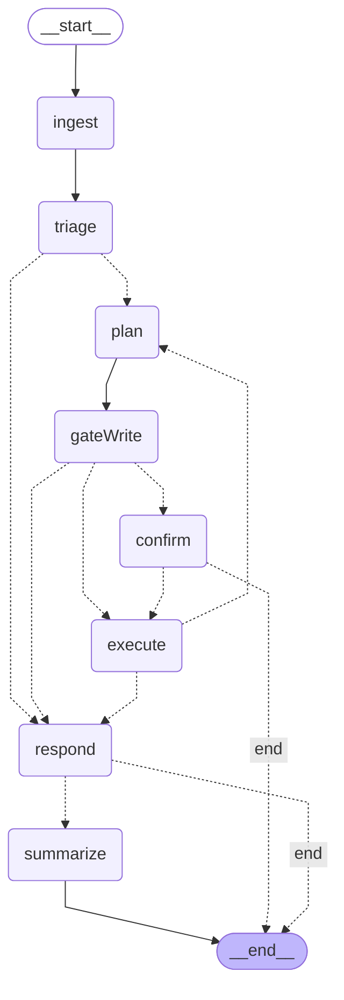

# LangGraph Runtime Architecture

> Auto-generated by `packages/teams-bot/src/scripts/dump-graph-mermaid.ts`.
> Regenerate when nodes or edges change. Do not hand-edit.
> Last generated: 2026-05-02.

## Graph topology

## Node summary

| Node | Purpose | LLM call? |
|---|---|---|
| `ingest` | Append HumanMessage; reset per-turn fields (`triageSignals`, `lastToolFacts`, `stepCount`); rotate `sessionId` if idle gap > `lg.session_timeout_minutes`. Defensive clear of `pendingWriteCall`. | No |
| `triage` | Cheap classifier (`cip-classifier` → mistral-nemo). Outputs non-binding `TriageSignals`. Failure falls back to `{needsTool: true, confidence: 0}`. | Yes (`bot.triage`) |
| `plan` | Strong planner (`cip-router-careful` → mistral-small). Calls `discoverTools(ctx, latestUserText)` directly (cached 5-min) for the candidate set. Native function-calling over those tools. Reads recent messages + summary + tool-reference markdown. **Slice 56I:** when `state.classifierDecision === 'narrow_plan'` AND `state.classifierPrediction.tool` is set, the candidate set is filtered to that one tool's schema (5–15× prompt-token reduction on these turns). Falls back to full catalog if the predicted tool isn't in the user's permitted set. | Yes (`bot.plan`) |
| `gateWrite` | For each tool call, look up `sideEffectLevel` via `discoverTools`. Write/external + not explicitly authorized → stage `pendingWriteCall`, route to `confirm`. | No |
| `confirm` | Calls `interrupt(payload)` — graph SUSPENDS. On resume (next user message via `Command({resume})`), classify reply as affirm/cancel via `classifyConfirmReply`. Affirm → emit AIMessage(tool_calls). Cancel → emit "Cancelled.". Unrecognized → emit safety message; cancel. | No |
| `execute` | Runs all tool_calls in parallel via `Promise.all`. Validates each name against current `discoverTools` cache (rejects hallucinated names). Distills 1-line fact via `distillFact()`. | No (MCP call) |
| `respond` | Surface final AIMessage. Runner sends it to Teams + adaptive-card footer with `turn=<id>` and (slice 56F) `[👍 Helpful] [👎 Wrong] [🔍 Inspect]` actions. 👎 fires a follow-up correction card; verdict + correction land in `bot_turn_metrics` for the trust-tier import. Slice 56F+ adds a runner-side last-resort fallback: if `respond` returned nothing usable, `result.lastToolFacts` are surfaced instead of "(I had nothing to say…)". | No |
| `summarize` | Compresses older messages into `state.summary` once `messages.length > lg.summarize_at` (default 12). Emits `RemoveMessage` for trimmed messages so the reducer actually drops them. | Yes (`bot.summarize`) |

## Conditional edges

| From → branches | Routing logic | Tunable |
|---|---|---|
| `triage` → `respond` / `plan` | If `triage.needsClarification` AND `triage.confidence ≥ lg.triage_clarify_threshold` AND `triage.clarificationQuestion` set → `respond`. Else → `plan`. | `lg.triage_clarify_threshold` |
| `gateWrite` → `confirm` / `execute` / `respond` | `pendingWriteCall` set → `confirm`. AIMessage has `tool_calls` → `execute`. Else → `respond`. | `lg.authorized_write_verbs` |
| `execute` → `plan` / `respond` | `stepCount ≥ lg.max_steps` → `respond`. Else → `plan` (loop). | `lg.max_steps` |
| `confirm` → `execute` / END | After interrupt resume: latest AIMessage has `tool_calls` (affirm path) → `execute`. Else (cancel / unrecognized) → END. | — |
| `respond` → `summarize` / END | `messages.length > lg.summarize_at` → `summarize`. Else → END. | `lg.summarize_at` |

## Confirm-resume mechanics (Slice 46b)

Native LangGraph 1.x `interrupt()` replaces the previous hand-rolled `pendingWriteCall` + ingest-resume dance. The `confirm` node calls `interrupt(payload)`; the graph suspends in place. PostgresSaver records the suspension point. The runner detects it via `graph.getState(config).tasks[*].interrupts`, renders the "About to:" prompt, and on the next user message invokes with `new Command({resume: userText})`. Execution continues from inside `confirm` from the line after `interrupt()` — `classifyConfirmReply` decides affirm/cancel/unrecognized, and the conditional edge routes to `execute` or END accordingly.

## State persistence

`PostgresSaver` (Slice 46) keyed by Teams `thread_id`, in `cip_hr.checkpoints` / `checkpoint_blobs` / `checkpoint_writes`. Multi-replica + restart-safe. Async durability default in LG 1.x (Slice 46c) — `interrupt()` forces sync at suspension points so the resume path stays safe. Nightly retention CronJob (Slice 46d) keeps the last 10 checkpoints per thread + last 24h, plus 90 days of `bot_turn_metrics`.

`candidateTools` was removed from state in Slice 46d — each consumer node calls `discoverTools(ctx, latestUserText)` directly. The cached lookup is sub-ms after warmup; net: zero bytes serialized for the tool catalog per checkpoint.

## Trace + session correlation (Slice 48 + follow-ups)

Each turn:
- Generates an 8-char hex `turnId` (response footer + `[turn]` log + `bot_turn_metrics`).
- Has a Langfuse session id rotated by `ingest` on idle > `lg.session_timeout_minutes` (default 60). Persisted in state as `sessionId`.
- Captures the OTEL-assigned `langfuse_trace_id` after `graph.invoke` from the `@langfuse/langchain` CallbackHandler's `last_trace_id` and persists it.
- Passes `metadata.session_id` and `metadata.trace_id` into every `callLLM` so LiteLLM's Langfuse plugin attaches LLM generations to OUR trace + session (Slice 46e follow-up). Trace ID comes from OTEL's active-span context inside the node.

`/turn <id>` slash command (admin, gated on `bot.metrics.read`) reads from `bot_turn_metrics`, fetches latency + cost from Langfuse public API, and renders a card with two deep-links: trace and session.

## OTEL bootstrap

`packages/teams-bot/src/instrumentation.ts` initializes a NodeSDK with `LangfuseSpanProcessor` BEFORE any LangChain import. Without this, `@langfuse/langchain`'s `CallbackHandler` constructs cleanly but emits nothing — the SDK is OTEL-based and doesn't auto-init from env vars alone.

