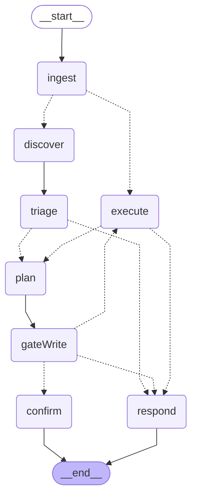

# LangGraph Runtime Architecture

> Auto-generated by `packages/teams-bot/src/scripts/dump-graph-mermaid.ts`.
> Regenerate when nodes or edges change. Do not hand-edit.
> Last generated: 2026-05-01.

## Graph topology

## Node summary

| Node | Purpose | LLM call? |
|---|---|---|
| `ingest` | Append HumanMessage; reset turn-scoped state. On confirm-resume, classify reply as affirm/cancel and synthesize an AIMessage with the saved tool call (skipping discover/triage/plan). | No |
| `discover` | Run `discoverTools(ctx, latestUserText)` — permission filter + Slice 44 vector retrieval. Hydrates `candidateTools`. Always re-runs (computed-not-persisted). | No |
| `triage` | Cheap classifier (`cip-classifier` → mistral-nemo). Outputs non-binding `TriageSignals`. Failure falls back to `{needsTool: true, confidence: 0}`. | Yes (`bot.triage`) |
| `plan` | Strong planner (`cip-router-careful` → mistral-small). Native function-calling over the candidate set. Reads recent messages + summary + tool-reference markdown. | Yes (`bot.plan`) |
| `gateWrite` | For each tool call, look up `sideEffectLevel`. Write/external + not explicitly authorized → stage `pendingWriteCall`, route to `confirm`. | No |
| `confirm` | Emit "About to: X. Reply yes/no." AIMessage. Graph ends; next user message resumes via `ingest`. | No |
| `execute` | Wraps `executeTool()`. Validates name against current `candidateTools` (rejects hallucinated names). Distills 1-line fact via `distillFact()`. | No (MCP call) |
| `respond` | Surface final AIMessage. Runner sends it to Teams + appends footer with `turn=<id>`. | No |

## Conditional edges

| From → branches | Routing logic | Tunable |
|---|---|---|
| `ingest` → `execute` / `discover` | If latest AIMessage has `tool_calls` (synthesized from `pendingWriteCall` resume) → `execute`. Else → `discover`. | — |
| `triage` → `respond` / `plan` | If `triage.needsClarification` AND `triage.confidence ≥ lg.triage_clarify_threshold` AND `triage.clarificationQuestion` set → `respond`. Else → `plan`. | `lg.triage_clarify_threshold` |
| `gateWrite` → `confirm` / `execute` / `respond` | `pendingWriteCall` set → `confirm`. AIMessage has `tool_calls` → `execute`. Else → `respond`. | `lg.authorized_write_verbs` |
| `execute` → `plan` / `respond` | `stepCount ≥ lg.max_steps` → `respond`. Else → `plan` (loop). | `lg.max_steps` |

## State persistence

In-process `MemorySaver` keyed by Teams `thread_id`. Survives node-to-node + successive turns within a pod's lifetime. Lost on restart, lost across replicas. **Slice 46** swaps to `PostgresSaver`.

`candidateTools` is computed-not-persisted — re-derived from the live MCP catalog on every turn entry AND on resume from a confirm interrupt. This guarantees a confirm→resume cycle uses the user's CURRENT permitted tool set.

## Trace correlation

Each turn generates an 8-char hex `turnId` at runner entry. It's:
- Surfaced in the Teams response footer as `turn=\`<id>\``
- Included in the `[turn]` log line as `turn=<id>`
- Passed as Langfuse `trace_id` metadata on every LLM call (Slice 48 wires this into the Langfuse trace tree)

To debug a turn: copy the `turn=<id>` from the user's footer, grep pod logs for `turn=<id>`, and (Slice 48) jump to the Langfuse trace.

(node:87683) [DEP0040] DeprecationWarning: The `punycode` module is deprecated. Please use a userland alternative instead.
(Use `node --trace-deprecation ...` to show where the warning was created)
