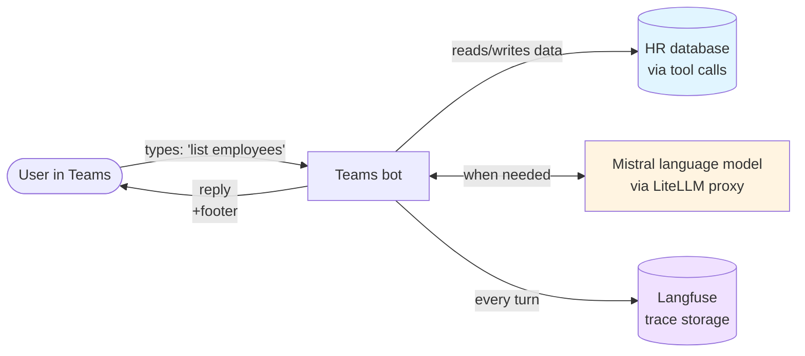
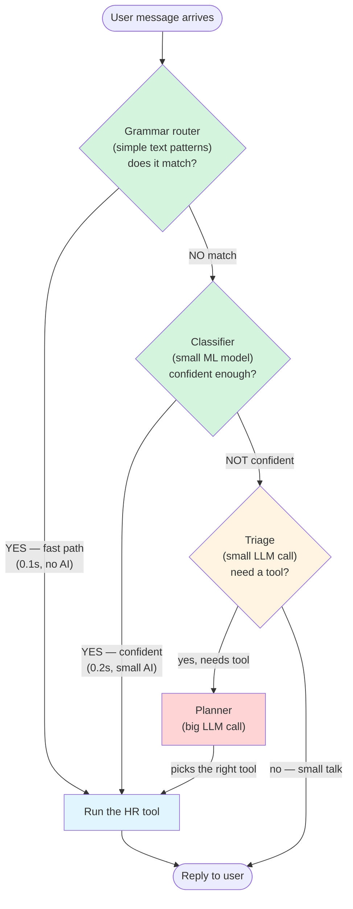
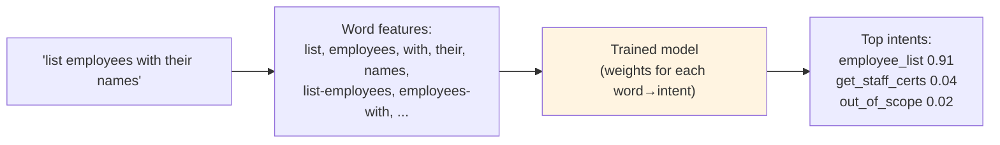
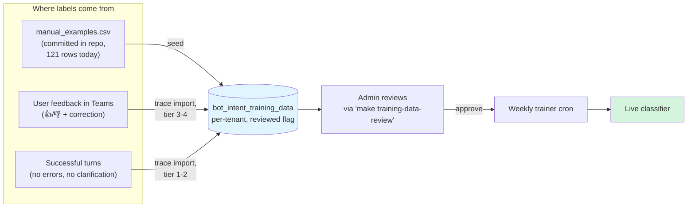
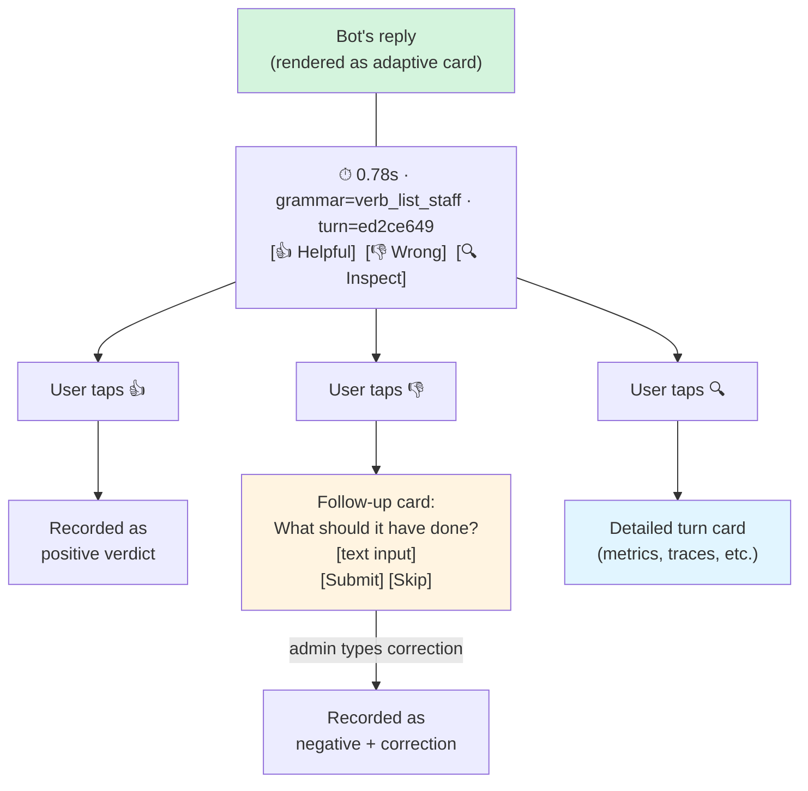
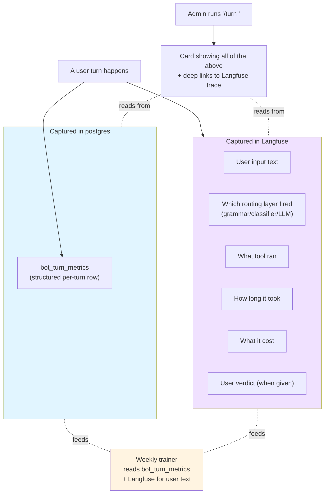
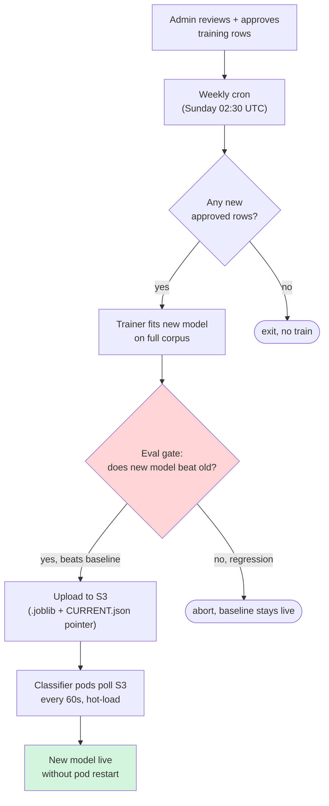
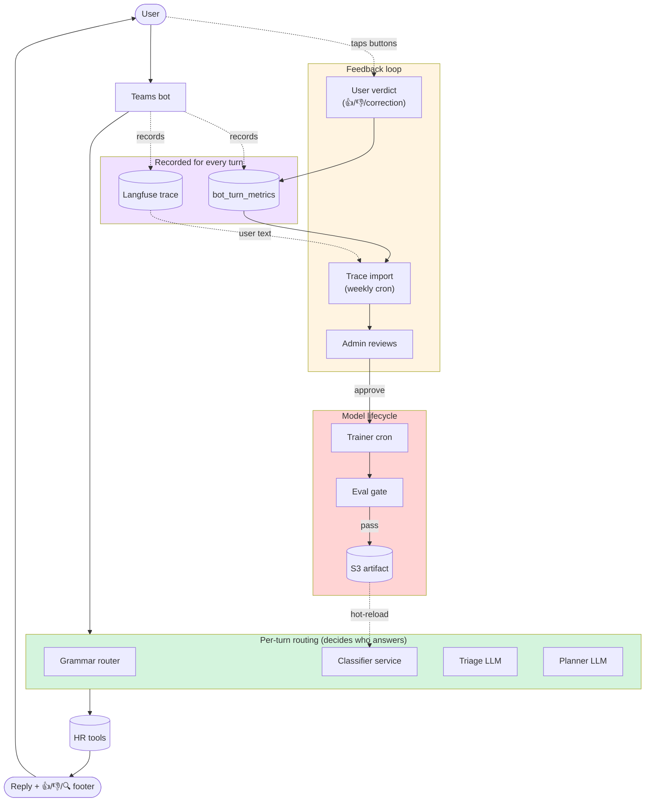

# Teams bot architecture — a tour for non-AI audiences

> Last updated: 2026-05-04 (after the slice 56 family — verdict UX,
> out-of-scope class, trust-tier import, narrow-plan, eval gate, and the
> "Add to training set" button on `/turn` cards).
>
> This doc is for audiences who haven't worked on AI/ML systems. It uses
> plain English where possible and notes the technical term in parens so
> a developer can dig deeper. Each diagram tells one part of the story.

---

## 1. Big picture — what happens when a user types in Teams

**Three external systems the bot talks to:**

- **HR database** (the actual data — employees, certifications, roles).
- **Mistral language model** (a "large language model" — the same kind of AI as ChatGPT, but smaller and cheaper). The bot uses it only when needed.
- **Langfuse** — a recording system that captures every conversation turn (timing, what tools were called, what the AI thought). Think of it as the bot's flight recorder.

---

## 2. Per-turn routing — the bot's "fast lane" / "slow lane" decision

When a user types something, the bot tries to answer in the cheapest, fastest way possible. It has **four layers** of routing, each one tries first:

**What each layer does:**

| Layer | How it decides | Speed | Cost |
|---|---|---|---|
| **Grammar router** | Hand-written text patterns (regex). Catches obvious phrasings like "list employees" or "show my roles." | <100ms | $0 — no AI |
| **Classifier** | A small machine-learning model trained on labelled examples. Works on phrasings the grammar misses, like "who works here". | ~200ms | ~$0 — tiny AI |
| **Triage** | A quick call to a small language model that decides: *does this need a tool, or is it small talk?* | ~700ms | ~$0.0002 |
| **Planner** | A full call to the Mistral language model with the catalog of available tools. It picks the right tool and fills in the arguments. | 1–3s | ~$0.001 |

The bot **always tries the cheapest layer first**. If a layer can't decide confidently, it falls through to the next one. Most simple requests ("list employees", "what are my roles") never reach the language model — they're handled by the grammar router or classifier in under a second, for free.

---

## 3. What the classifier is and how it learns

### What is "the classifier"?

It's a small mathematical model that reads the user's message and predicts:

- **Which intent** the user has (e.g. `list_employees`, `disable_employee`, `out_of_scope`).
- **How confident** it is (a number from 0 to 1).

It uses a technique called TF-IDF (counts which words and word-pairs appear, weighted by how unusual they are) plus logistic regression (turns those counts into per-intent probabilities). Both are old, simple, well-understood algorithms — no neural network, no GPU, no internet calls.

The model lives as a file (a `.joblib` "artifact") in object storage. The classifier service downloads the latest version every minute and uses it for predictions.

### How it learns — the two training-data streams

The classifier needs **labelled examples** to learn from: pairs of `(text, correct intent)`. Two streams keep adding labels over time:

**The trust ladder** (newest insight from research-backed review):

| Tier | Signal | Trust |
|---|---|---|
| 4 | User tapped 👍 on the bot's reply | Highest |
| 3 | User tapped 👎 and typed a correction | Highest |
| 2 | Bot's grammar/classifier handled the turn cleanly | Medium |
| 1 | Bot's language-model planner handled the turn cleanly | Lowest |

All four flow into the same database table. **All four require admin approval** (the `reviewed=false` flag) before they feed the next training run. We don't trust automatic signals enough to auto-promote — the research is clear that explicit user feedback is the most reliable, but even thumbs can be noisy.

---

## 4. The feedback loop in Teams

Every bot reply now ends with three buttons:

**Why the follow-up card on 👎 is the most valuable interaction:**

A plain 👎 tells us "this was wrong" but not "what should have happened." Research on chatbot training (Microsoft LUIS, Google's PAIR guidance, Rasa's CDD docs) is clear that **explicit corrections** ("should have called employee_disable instead") are the highest-quality training signal we can collect. The follow-up card is where the bot asks for that signal.

The correction goes into the database with `source = confusion_correction`. The trainer can use it both to teach the right intent for that phrasing AND, in future, as a hard negative example (this text is NOT the intent the bot guessed).

---

## 5. Langfuse — the recording system

Every bot turn is recorded in Langfuse. This is invaluable for debugging ("why did the bot do that?") and for measuring quality at scale.

**Two separate stores, on purpose:**

- `bot_turn_metrics` (postgres) — structured, indexable rows. Used for queries: "how many turns called the right tool last week?", "which intents have the most negative verdicts?". Doesn't store user text (privacy default).
- **Langfuse** — full trace tree per turn. Has the raw user text, every LLM call's input/output, and timings. Used for debugging individual turns. Has retention limits.

The `/turn <id>` admin command joins both: structured metrics from postgres + a deep link to the Langfuse trace.

---

## 6. The model lifecycle — from training to live

**Key properties:**

- **Hot-reload, no downtime.** Training a new model doesn't restart any service. Pods notice the new pointer file, download the new model, swap it into memory.
- **Eval gate before promotion.** A new model is only published if (a) it beats the prior model's overall F1 score by ≥1 percentage point, AND (b) no individual intent regresses by more than 5 percentage points. If either fails, the old model stays live and the trainer aborts.
- **Skip-if-empty.** If no new training rows have been approved since the last training run, the cron skips. Avoids retraining on no signal.
- **Per-tenant models supported.** Off by default; flip `CLASSIFIER_PER_TENANT_ENABLED=true` to opt in. Each tenant can have its own model trained on its own data.

---

## 7. The complete picture

Putting it all together:

---

## 8. What the slice 56 family delivered

Reading top-down, this whole architecture got built across 11 small ships:

| Slice | What it added |
|---|---|
| 55 | Grammar router (regex fast-path) + per-tool argument extractors + disambiguation cards |
| 56 | The classifier service itself (Python + sklearn) |
| 56B | Model lifecycle (training-data lifecycle, S3 hot-reload, model lineage tables) |
| 56C | In-cluster trainer cron (no more "run from workstation") |
| 56D | Per-tenant model support |
| 56E | Trace-export auto-import from Langfuse |
| **56F** | **Verdict UX (👍/👎 buttons + correction follow-up card)** |
| **56G** | **Out-of-scope class + bolster all classes to ≥15 examples + restore confidence threshold** |
| **56H** | **Trust-tier-aware import (verdicts now drive priority)** |
| **56I** | **Narrow-plan wired for real (was theatrical until now)** |
| **56J** | **Eval gate restored (no regression promotions)** |
| **56K** | **"Add to training set" button on `/turn` cards (slice 55 promise, finally)** |

The bolded slices (56F-K) are anchored in evidence-based research from
Rasa's CDD docs, Microsoft LUIS active-learning patterns, Larson et al.
2019 (CLINC150 OOD benchmark), and the Arize tool-routing best
practices guide. See `slices/SLICE_56_FAMILY_REVIEW.md` for the full
audit and citations.

---

## 9. Reliability behaviors worth knowing

**Defense-in-depth for "the bot has nothing to say":** if the planner ran tools but the final reply assembly went sideways (a real bug surfaced during testing), the runner's last-resort fallback now surfaces the distilled tool result (e.g. *"employee_get: Susan Smith (3 role(s))"*) instead of returning *"(I had nothing to say — try rephrasing?)"*. The user gets *something* useful even when the response-rendering path silently fails. A diagnostic log fires in that case so engineers can find the root cause from pod logs.

**Per-tenant kill switches everywhere.** Every layer (grammar router, classifier, per-tenant models, verdict UI) has a tunable in `bot_tunables` that defaults the feature ON or OFF per the slice's risk profile. Operators can turn off any layer for a single tenant without redeploying.

**No turn fails because of routing.** Classifier service down, grammar regex erroring, verdict tool unreachable — every error path falls through to the existing planner (or, in the planner's worst case, to the response-time fallback above). The user always gets *some* reply.

**Eval gate before model promotion.** The trainer cron pulls the current production model from S3 as a baseline, evaluates the candidate against it, and **aborts the training run** if the candidate regresses macro-F1 by even a fraction of a point or drops any individual class by more than 5 percentage points. Bad models never go live; the existing model stays serving.

---

## 10. What this isn't (yet)

For honesty's sake, things this architecture does NOT do today:

- **Active learning prioritization** of admin reviews. We collect feedback; we don't yet rank "which 20 turns should the admin look at first?" by uncertainty. (Future work — Mussmann & Liang 2018 supports the approach.)
- **Auto-promotion of high-trust rows** (e.g. tier 3-4) without admin review. The literature is mixed on whether thumbs-up are clean enough to auto-train on; we're conservative until we have data on our own verdict signal noise.
- **Confusion-matrix dashboards** for finding "this intent confuses with that one." Nice-to-have; not in the box.
- **Migrating off sklearn** to something heavier (DistilBERT, SetFit). Defers until the corpus is mature enough to plateau on simpler models.
